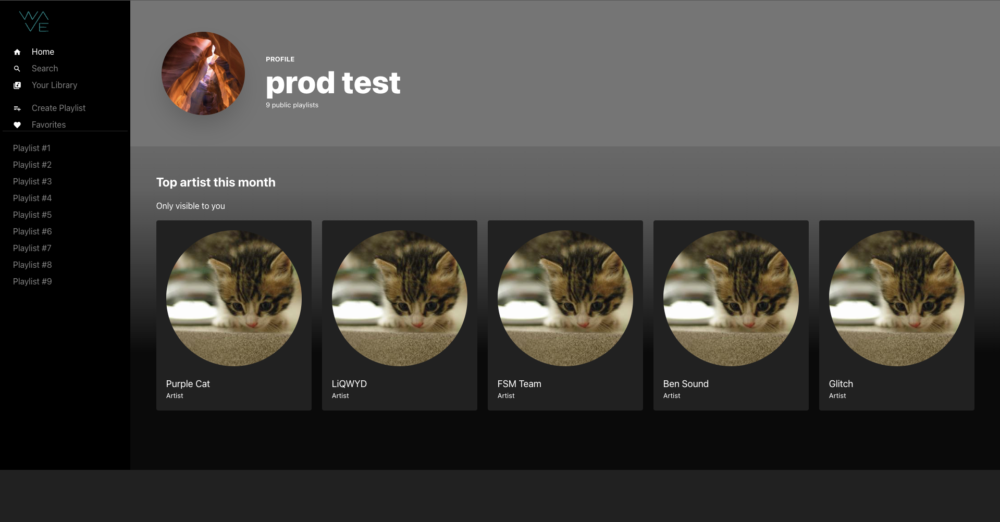
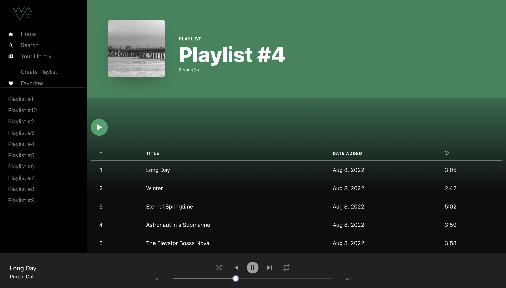

# Waves
Waves is a music player with an intuitive beautiful design. 

## Features
Waves currently features playlists with a fully functional music player that has the ability to repeat, skip forward and backward between songs, seek to a certain time in a song, and shuffle. Some features currently in development include the ability to add a song to your favorites, the ability to create a playlist, and search for songs.

## Dependencies
- charkraUI
- prisma
- bcrytp
- cookie
- cookies
- easy-peasy
- format-duration
- framer-motion
- jsonwebtoken
- next
- react
- react icons
- swr
